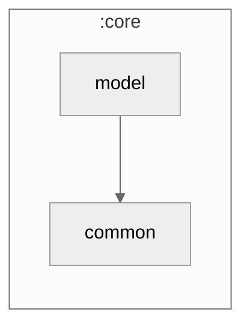

### Module Graph



### Ownership — declare the template's, everything else is the fork's

`core/model` holds plain data classes: no DI, no registry, nothing generated. What it *does* need is
a lifecycle for each package, because two different things rewrite a fork's tree — `remove-demo.sh`
(the customizer) and `/kmp-project-template-sync`. Both are driven from ONE declaration:

```yaml
# app-profile/app.yaml
model:
  packages:
    # demo:begin
    - { id: banking,   owner: template }   # …the 10 showcase domains
    # demo:end
    - { id: user,      owner: fork }       # framework models — kept by --clean
```

**Only the TEMPLATE's packages are declared.** A fork's own package needs no row: the strip never
names it, and the ownership contract resolves it `fork` through the module catch-all. That asymmetry
is the whole design — one list to delete, everything else stays.

```
kpt/core/model/
  banking/  crypto/  currency/  …   ← declared owner:template → deleted by --clean
  user/                             ← declared owner:fork     → kept by --clean
  invoice/                          ← YOUR package, undeclared → kept, never synced over
```

#### Adding a model

- **A fork's own** — create `kpt/core/model/<domain>/` and write the class. Nothing to declare. It is
  fork-owned from the moment it exists.
- **A template showcase domain** — create the package AND add a row inside the `# demo:begin/end`
  fence, AND a `demo-showcase` rule in `customization-surface.yaml`. `G-MODEL-PKG` (MP-1) fails the
  build if you add the row and forget the rule — without it the package resolves `fork` and silently
  stops reaching forks on sync.

#### The two `owner:` fields are different axes

This trips people up, so it is worth stating plainly. The same word means different things in the two
files, because they answer different questions:

| | `app-profile#model.packages[].owner` | `customization-surface.yaml` owner |
|---|---|---|
| Question | does `--clean` DELETE it? | does a sync OVERWRITE it? |
| `template` | yes, deleted | yes, full-copied |
| `fork` | no, kept | no, never touched |
| `demo-showcase` | — | shipped by the template, updated on sync, deleted by `--clean` |

So `user` is `owner: fork` in app-profile (a clean fork KEEPS the framework models — it needs them)
while resolving `template` on the surface (it is template-authored, so a fork should keep receiving
fixes to it). `core/store`'s `prefs` is the same call. Neither is a contradiction: kept-by-strip and
overwritten-by-sync are independent.

#### Why not a named `project/` seam

An earlier revision put fork models in a dedicated `kpt.core.model.project` package, mirroring
`ProjectErrorMapper` / `ProjectDatabaseModule` elsewhere. It was redundant: those seams exist because
a fork must plug into template-owned WIRING at a specific point. Models have no wiring — a fork's
type is just a type. Once the template's packages are declared, "fork" is definitionally everything
else, so a named package added ceremony without adding safety.

#### Do not edit `user/`

The framework reads those types. A fork adds its own preferences through `ProjectPreferencesRepository`
in `core/datastore`, which extends the framework repository by delegation and stores fork data
separately — so `UserData` never needs a fork field.

#### History

The showcase used to live under `kpt/core/model/demo/**`, stripped by the generic `**/demo/**` sweep.
That worked, but a directory NAME was the only thing encoding the lifecycle — nothing could read it,
and `core/model` was the last core module still on that convention while `core/store` and
`core/database` had moved to declared packages. Moving it also surfaced a real bug in the shared
sweep: its source-set list was hardcoded and missed `desktopTest`, so a declared package could be
deleted from `commonMain` while its test survived, referencing types that no longer existed. The
sweep now enumerates source sets.

Enforced by `scripts/product-health/checks/model-package-ownership.sh` (MP-1..MP-4).
